# prayerloop

## Tables

| Name                                                            | Columns | Comment                                | Type       |
| --------------------------------------------------------------- | ------- | -------------------------------------- | ---------- |
| [public.group_invite](public.group_invite.md)                   | 9       | Group invitation codes                 | BASE TABLE |
| [public.group_profile](public.group_profile.md)                 | 9       | Prayer groups                          | BASE TABLE |
| [public.notification](public.notification.md)                   | 9       | User notifications                     | BASE TABLE |
| [public.password_reset_tokens](public.password_reset_tokens.md) | 7       | Password reset verification codes      | BASE TABLE |
| [public.prayer](public.prayer.md)                               | 13      | Individual prayer requests             | BASE TABLE |
| [public.prayer_access](public.prayer_access.md)                 | 9       | Controls prayer visibility and sharing | BASE TABLE |
| [public.prayer_analytics](public.prayer_analytics.md)           | 7       | Prayer interaction tracking            | BASE TABLE |
| [public.prayer_category](public.prayer_category.md)             | 10      | Prayer category definitions            | BASE TABLE |
| [public.prayer_category_item](public.prayer_category_item.md)   | 5       | Prayers assigned to categories         | BASE TABLE |
| [public.prayer_session](public.prayer_session.md)               | 4       | Prayer session tracking                | BASE TABLE |
| [public.prayer_session_detail](public.prayer_session_detail.md) | 5       | Individual prayers within a session    | BASE TABLE |
| [public.preference](public.preference.md)                       | 10      | System preference definitions          | BASE TABLE |
| [public.user_group](public.user_group.md)                       | 9       | User-to-group membership               | BASE TABLE |
| [public.user_preferences](public.user_preferences.md)           | 7       | User-specific preference values        | BASE TABLE |
| [public.user_profile](public.user_profile.md)                   | 16      | Core user account information          | BASE TABLE |
| [public.user_push_tokens](public.user_push_tokens.md)           | 6       | FCM push notification tokens           | BASE TABLE |
| [public.user_stats](public.user_stats.md)                       | 6       | Aggregated user statistics             | BASE TABLE |

## Stored procedures and functions

| Name                                        | ReturnType | Arguments | Type     |
| ------------------------------------------- | ---------- | --------- | -------- |
| public.set_datetime_create                  | trigger    |           | FUNCTION |
| public.set_default_datetime_expires         | trigger    |           | FUNCTION |
| public.set_default_expires_at               | trigger    |           | FUNCTION |
| public.set_password_reset_tokens_created_at | trigger    |           | FUNCTION |
| public.set_user_push_tokens_created_at      | trigger    |           | FUNCTION |
| public.update_datetime_update               | trigger    |           | FUNCTION |
| public.update_user_push_tokens_updated_at   | trigger    |           | FUNCTION |

## Relations

```mermaid
erDiagram

"public.group_invite" }o--|| "public.group_profile" : "FOREIGN KEY (group_profile_id) REFERENCES group_profile(group_profile_id) ON DELETE CASCADE"
"public.notification" }o--|| "public.user_profile" : "FOREIGN KEY (user_profile_id) REFERENCES user_profile(user_profile_id)"
"public.password_reset_tokens" }o--|| "public.user_profile" : "FOREIGN KEY (user_profile_id) REFERENCES user_profile(user_profile_id) ON DELETE CASCADE"
"public.prayer_access" }o--|| "public.prayer" : "FOREIGN KEY (prayer_id) REFERENCES prayer(prayer_id)"
"public.prayer_analytics" }o--|| "public.prayer" : "FOREIGN KEY (prayer_id) REFERENCES prayer(prayer_id)"
"public.prayer_category_item" |o--|| "public.prayer_access" : "FOREIGN KEY (prayer_access_id) REFERENCES prayer_access(prayer_access_id) ON DELETE CASCADE"
"public.prayer_category_item" }o--|| "public.prayer_category" : "FOREIGN KEY (prayer_category_id) REFERENCES prayer_category(prayer_category_id) ON DELETE CASCADE"
"public.prayer_session" }o--|| "public.user_profile" : "FOREIGN KEY (user_profile_id) REFERENCES user_profile(user_profile_id)"
"public.prayer_session_detail" }o--|| "public.prayer" : "FOREIGN KEY (prayer_id) REFERENCES prayer(prayer_id)"
"public.prayer_session_detail" }o--|| "public.prayer_session" : "FOREIGN KEY (prayer_session_id) REFERENCES prayer_session(prayer_session_id)"
"public.user_group" }o--|| "public.group_profile" : "FOREIGN KEY (group_profile_id) REFERENCES group_profile(group_profile_id)"
"public.user_group" }o--|| "public.user_profile" : "FOREIGN KEY (user_profile_id) REFERENCES user_profile(user_profile_id)"
"public.user_preferences" }o--|| "public.user_profile" : "FOREIGN KEY (user_profile_id) REFERENCES user_profile(user_profile_id) ON DELETE CASCADE"
"public.user_push_tokens" }o--|| "public.user_profile" : "FOREIGN KEY (user_profile_id) REFERENCES user_profile(user_profile_id) ON DELETE CASCADE"
"public.user_stats" }o--|| "public.user_profile" : "FOREIGN KEY (user_profile_id) REFERENCES user_profile(user_profile_id)"

"public.group_invite" {
  integer created_by "User ID of the creator of the invite."
  timestamp_without_time_zone datetime_create "Timestamp when the invite was created."
  timestamp_without_time_zone datetime_expires "Timestamp when the invite expires."
  timestamp_without_time_zone datetime_update "Timestamp when the invite was last updated."
  integer group_invite_id "Unique identifier for the group invite."
  integer group_profile_id FK "Unique identifier for the group."
  varchar_50_ invite_code "Unique code for the invite."
  boolean is_active "Indicates if the invite is active.  Used for revoking invites."
  integer updated_by "User ID of the last updater of the invite."
}
"public.group_profile" {
  integer created_by "User ID of the creator of the group."
  timestamp_without_time_zone datetime_create "Timestamp when the group was created."
  timestamp_without_time_zone datetime_update "Timestamp when the group was last updated."
  boolean deleted "Indicates if the group has been marked as deleted."
  varchar_500_ group_description "Description of the group."
  varchar_255_ group_name "This field holds the name of the group."
  integer group_profile_id "Unique identifier for the group."
  boolean is_active "Indicates if the group is active."
  integer updated_by "User ID of the last updater of the group."
}
"public.notification" {
  integer created_by "User ID of the creator of this record."
  timestamp_without_time_zone datetime_create "Timestamp when the notification was created."
  timestamp_without_time_zone datetime_update "Timestamp when the notification was last updated."
  integer notification_id "Unique identifier for each notification."
  text notification_message "Content of the notification."
  varchar_20_ notification_status "Status of the notification (e.g., read, unread)."
  varchar_50_ notification_type "Type of notification (e.g., invitation, prayer request)."
  integer updated_by "User ID of the last updater of this record."
  integer user_profile_id FK "ID of the user receiving the notification."
}
"public.password_reset_tokens" {
  integer attempts "Number of verification attempts (max 3 allowed)."
  varchar_6_ code "6-digit verification code sent to user email."
  timestamp_without_time_zone created_at "Timestamp when the reset code was created."
  timestamp_without_time_zone expires_at "Timestamp when the code expires (typically 15 minutes from creation)."
  integer password_reset_tokens_id ""
  boolean used "Indicates whether the code has been used (prevents reuse)."
  integer user_profile_id FK "ID of the user requesting password reset."
}
"public.prayer" {
  integer created_by "User ID of the creator of this record."
  timestamp_without_time_zone datetime_answered "Timestamp when the prayer was answered."
  timestamp_without_time_zone datetime_create "Timestamp when the record was created."
  timestamp_without_time_zone datetime_update "Timestamp when the record was last updated."
  boolean deleted "Indicates if the prayer request has been marked as deleted."
  boolean is_answered "Indicates if the prayer has been answered."
  boolean is_private "Indicates if the prayer request is private."
  varchar_3000_ prayer_description ""
  integer prayer_id "Unique identifier for each prayer request."
  integer prayer_priority ""
  varchar_20_ prayer_type ""
  varchar_250_ title "Title of the prayer request."
  integer updated_by "User ID of who last updated this record."
}
"public.prayer_access" {
  varchar_5_ access_type "Type of access (e.g., 'user', 'group')."
  integer access_type_id "ID value of the associated type (e.g., if access_type is user, then use user.user_profile_id value)."
  integer created_by "User ID of the creator of this record."
  timestamp_without_time_zone datetime_create "Timestamp when the record was created."
  timestamp_without_time_zone datetime_update "Timestamp when the record was last updated."
  integer display_sequence "User-defined display order for prayers. Lower values appear first. Sequential integers (0, 1, 2...)."
  integer prayer_access_id "Unique identifier for each prayer access record."
  integer prayer_id FK "Foreign key referencing the prayer request."
  integer updated_by "User ID of who last updated this record."
}
"public.prayer_analytics" {
  timestamp_without_time_zone datetime_last_prayed "Timestamp of the last time this prayer was prayed."
  integer last_prayed_by "User ID of the last user who prayed for this request."
  integer num_shares "Number of times this prayer request has been shared."
  integer num_unique_users "Number of unique users who have prayed for this request."
  integer prayer_analytics_id "Unique identifier for each prayer analytics record."
  integer prayer_id FK "Foreign key referencing the associated prayer request."
  integer total_prayers "Total number of prayers for this request."
}
"public.prayer_category" {
  varchar_20_ category_color "Hex color code for visual distinction (e.g., '#90c590')."
  varchar_100_ category_name "Name of the category (e.g., 'Family', 'Work', 'Health')."
  varchar_5_ category_type "Type of category ('user' for personal categories, 'group' for shared group categories)."
  integer category_type_id "ID value of the associated type (e.g., if category_type is user, then user_profile_id; if group, then group_profile_id)."
  integer created_by "User ID of the creator of this category."
  timestamp_without_time_zone datetime_create "Timestamp when the category was created."
  timestamp_without_time_zone datetime_update "Timestamp when the category was last updated."
  integer display_sequence "User-defined display order for categories. Lower values appear first. Sequential integers (0, 1, 2...)."
  integer prayer_category_id "Unique identifier for each category."
  integer updated_by "User ID of who last updated this category."
}
"public.prayer_category_item" {
  integer created_by "User ID who assigned the prayer to this category."
  timestamp_without_time_zone datetime_create "Timestamp when the prayer was added to the category."
  integer prayer_access_id FK "Foreign key referencing the prayer access record."
  integer prayer_category_id FK "Foreign key referencing the prayer category."
  integer prayer_category_item_id "Unique identifier for each category-prayer relationship."
}
"public.prayer_session" {
  timestamp_without_time_zone end_time "Timestamp when the prayer session ends (optional)."
  integer prayer_session_id "Unique identifier for each prayer session."
  timestamp_without_time_zone start_time "Timestamp when the prayer session starts."
  integer user_profile_id FK "Foreign key referencing the user participating in the prayer session."
}
"public.prayer_session_detail" {
  timestamp_without_time_zone end_time "Timestamp when the prayer session detail ends (optional)."
  integer prayer_id FK "Foreign key referencing the associated prayer request."
  integer prayer_session_detail_id "Unique identifier for each prayer session detail record."
  integer prayer_session_id FK "Foreign key referencing the associated prayer session."
  timestamp_without_time_zone start_time "Timestamp when the prayer session detail starts."
}
"public.preference" {
  integer created_by ""
  timestamp_without_time_zone datetime_create ""
  timestamp_without_time_zone datetime_update ""
  varchar_500_ default_value "Default value for this preference."
  text description "Human-readable description of what this preference controls."
  boolean is_active "Whether this preference is currently active/available."
  integer preference_id ""
  varchar_100_ preference_key "Unique key identifying the preference (e.g., notifications, theme)."
  integer updated_by ""
  varchar_50_ value_type "Data type of the preference value (string, boolean, number)."
}
"public.user_group" {
  integer created_by "User ID of the creator of this record."
  timestamp_without_time_zone datetime_create "Timestamp when the record was created."
  timestamp_without_time_zone datetime_update "Timestamp when the record was last updated."
  integer group_display_sequence "User-defined display order for groups. Lower values appear first. Sequential integers (0, 1, 2...)."
  integer group_profile_id FK "ID of the group to which the user belongs."
  boolean is_active "Indicates if the user-group relationship is active."
  integer updated_by "User ID of the last updater of this record."
  integer user_group_id "Unique identifier for the user-group relationship."
  integer user_profile_id FK "ID of the user participating in the group."
}
"public.user_preferences" {
  timestamp_without_time_zone datetime_create "Timestamp when the preference was created."
  timestamp_without_time_zone datetime_update "Timestamp when the preference was last updated."
  boolean is_active "Indicates if the preference is active. This can be used to disable a preference without deleting it."
  varchar_50_ preference_key "The key for the preference setting (e.g., theme, notifications)."
  text preference_value "The value for the preference setting (e.g., dark mode, true/false)."
  integer user_preferences_id "Unique identifier for the user preference entry."
  integer user_profile_id FK "Unique identifier for the user."
}
"public.user_profile" {
  boolean admin "Indicates if the user has admin privileges."
  integer created_by "User ID of the creator of this record."
  timestamp_without_time_zone datetime_create "Timestamp when the user record was created."
  timestamp_without_time_zone datetime_update "Timestamp when the user record was last updated."
  boolean deleted "Indicates if the user account has been marked as deleted."
  varchar_255_ email "The user's email address (optional)."
  boolean email_verified "Indicates if the user's email has been verified."
  varchar_255_ first_name "The user's first name."
  varchar_255_ last_name "The user's last name."
  varchar_255_ password "The user's password (hashed)."
  varchar_20_ phone_number "The user's phone number (optional)."
  boolean phone_verified "Indicates if the user's phone number has been verified."
  integer updated_by "User ID of who last updated this record."
  integer user_profile_id "Unique identifier for the user."
  varchar_255_ username "The user's chosen username (must be unique)."
  varchar_255_ verification_token "Token used for email/phone verification."
}
"public.user_push_tokens" {
  timestamp_without_time_zone created_at "Timestamp when the record was created."
  varchar_10_ platform "The platform for which the push token is valid (ios or android)."
  varchar_500_ push_token "The push notification token for the user."
  timestamp_without_time_zone updated_at "Timestamp when the record was last updated."
  integer user_profile_id FK "ID of the user associated with the push token."
  integer user_push_tokens_id "Unique identifier for the push token record."
}
"public.user_stats" {
  integer active_streak "Current streak of consecutive active days."
  integer days_active "Total number of days the user has been active."
  integer prayers_prayed "Total number of prayers prayed by the user."
  interval time_prayed "Total time spent praying by the user."
  integer user_profile_id FK "Foreign key referencing the associated user."
  integer user_stats_id "Unique identifier for each user stats record."
}
```

---

> Generated by [tbls](https://github.com/k1LoW/tbls)
