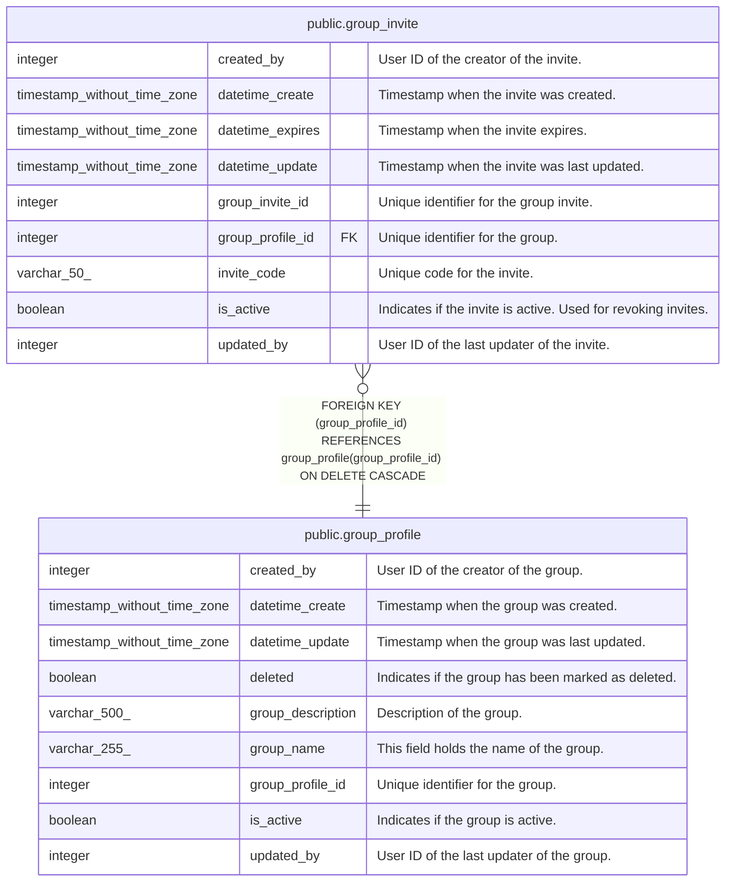

# public.group_invite

## Description

Group invitation codes

## Columns

| Name             | Type                        | Default                                               | Nullable | Children | Parents                                         | Comment                                                        |
| ---------------- | --------------------------- | ----------------------------------------------------- | -------- | -------- | ----------------------------------------------- | -------------------------------------------------------------- |
| created_by       | integer                     |                                                       | false    |          |                                                 | User ID of the creator of the invite.                          |
| datetime_create  | timestamp without time zone | CURRENT_TIMESTAMP                                     | true     |          |                                                 | Timestamp when the invite was created.                         |
| datetime_expires | timestamp without time zone |                                                       | true     |          |                                                 | Timestamp when the invite expires.                             |
| datetime_update  | timestamp without time zone | CURRENT_TIMESTAMP                                     | true     |          |                                                 | Timestamp when the invite was last updated.                    |
| group_invite_id  | integer                     | nextval('group_invite_group_invite_id_seq'::regclass) | false    |          |                                                 | Unique identifier for the group invite.                        |
| group_profile_id | integer                     |                                                       | false    |          | [public.group_profile](public.group_profile.md) | Unique identifier for the group.                               |
| invite_code      | varchar(50)                 |                                                       | false    |          |                                                 | Unique code for the invite.                                    |
| is_active        | boolean                     | true                                                  | true     |          |                                                 | Indicates if the invite is active.  Used for revoking invites. |
| updated_by       | integer                     |                                                       | false    |          |                                                 | User ID of the last updater of the invite.                     |

## Constraints

| Name                               | Type        | Definition                                                                                  |
| ---------------------------------- | ----------- | ------------------------------------------------------------------------------------------- |
| group_invite_group_profile_id_fkey | FOREIGN KEY | FOREIGN KEY (group_profile_id) REFERENCES group_profile(group_profile_id) ON DELETE CASCADE |
| group_invite_invite_code_key       | UNIQUE      | UNIQUE (invite_code)                                                                        |
| group_invite_pkey                  | PRIMARY KEY | PRIMARY KEY (group_invite_id)                                                               |

## Indexes

| Name                              | Definition                                                                                           |
| --------------------------------- | ---------------------------------------------------------------------------------------------------- |
| group_invite_invite_code_key      | CREATE UNIQUE INDEX group_invite_invite_code_key ON public.group_invite USING btree (invite_code)    |
| group_invite_pkey                 | CREATE UNIQUE INDEX group_invite_pkey ON public.group_invite USING btree (group_invite_id)           |
| idx_group_invite_code             | CREATE UNIQUE INDEX idx_group_invite_code ON public.group_invite USING btree (invite_code)           |
| idx_group_invite_group_profile_id | CREATE INDEX idx_group_invite_group_profile_id ON public.group_invite USING btree (group_profile_id) |

## Triggers

| Name                               | Definition                                                                                                                                          |
| ---------------------------------- | --------------------------------------------------------------------------------------------------------------------------------------------------- |
| set_datetime_create_trigger        | CREATE TRIGGER set_datetime_create_trigger BEFORE INSERT ON public.group_invite FOR EACH ROW EXECUTE FUNCTION set_datetime_create()                 |
| set_datetime_expires_before_insert | CREATE TRIGGER set_datetime_expires_before_insert BEFORE INSERT ON public.group_invite FOR EACH ROW EXECUTE FUNCTION set_default_datetime_expires() |
| set_datetime_update                | CREATE TRIGGER set_datetime_update BEFORE UPDATE ON public.group_invite FOR EACH ROW EXECUTE FUNCTION update_datetime_update()                      |

## Relations

---

> Generated by [tbls](https://github.com/k1LoW/tbls)
