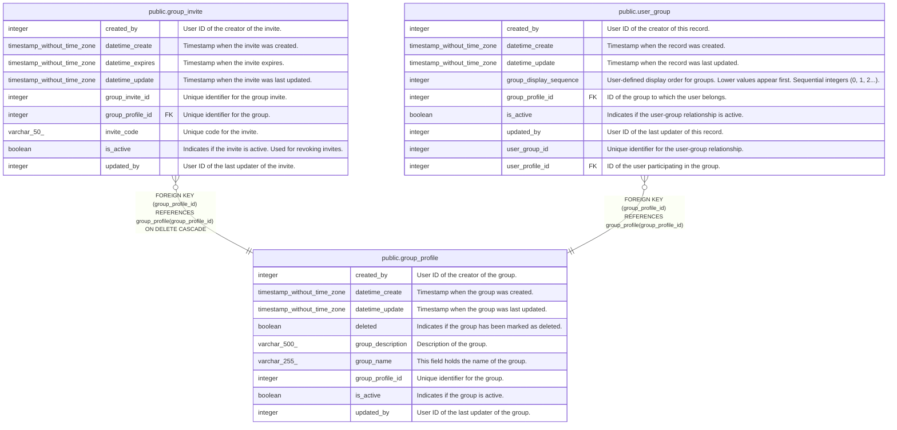

# public.group_profile

## Description

Prayer groups

## Columns

| Name              | Type                        | Default                                                 | Nullable | Children                                                                                | Parents | Comment                                            |
| ----------------- | --------------------------- | ------------------------------------------------------- | -------- | --------------------------------------------------------------------------------------- | ------- | -------------------------------------------------- |
| created_by        | integer                     |                                                         | false    |                                                                                         |         | User ID of the creator of the group.               |
| datetime_create   | timestamp without time zone | CURRENT_TIMESTAMP                                       | true     |                                                                                         |         | Timestamp when the group was created.              |
| datetime_update   | timestamp without time zone | CURRENT_TIMESTAMP                                       | true     |                                                                                         |         | Timestamp when the group was last updated.         |
| deleted           | boolean                     | false                                                   | true     |                                                                                         |         | Indicates if the group has been marked as deleted. |
| group_description | varchar(500)                |                                                         | true     |                                                                                         |         | Description of the group.                          |
| group_name        | varchar(255)                |                                                         | false    |                                                                                         |         | This field holds the name of the group.            |
| group_profile_id  | integer                     | nextval('group_profile_group_profile_id_seq'::regclass) | false    | [public.group_invite](public.group_invite.md) [public.user_group](public.user_group.md) |         | Unique identifier for the group.                   |
| is_active         | boolean                     | true                                                    | true     |                                                                                         |         | Indicates if the group is active.                  |
| updated_by        | integer                     |                                                         | false    |                                                                                         |         | User ID of the last updater of the group.          |

## Constraints

| Name               | Type        | Definition                     |
| ------------------ | ----------- | ------------------------------ |
| group_profile_pkey | PRIMARY KEY | PRIMARY KEY (group_profile_id) |

## Indexes

| Name                 | Definition                                                                                                   |
| -------------------- | ------------------------------------------------------------------------------------------------------------ |
| group_profile_pkey   | CREATE UNIQUE INDEX group_profile_pkey ON public.group_profile USING btree (group_profile_id)                |
| idx_group_group_name | CREATE UNIQUE INDEX idx_group_group_name ON public.group_profile USING btree (group_name, group_description) |

## Triggers

| Name                        | Definition                                                                                                                           |
| --------------------------- | ------------------------------------------------------------------------------------------------------------------------------------ |
| set_datetime_create_trigger | CREATE TRIGGER set_datetime_create_trigger BEFORE INSERT ON public.group_profile FOR EACH ROW EXECUTE FUNCTION set_datetime_create() |
| set_datetime_update         | CREATE TRIGGER set_datetime_update BEFORE UPDATE ON public.group_profile FOR EACH ROW EXECUTE FUNCTION update_datetime_update()      |

## Relations

---

> Generated by [tbls](https://github.com/k1LoW/tbls)
