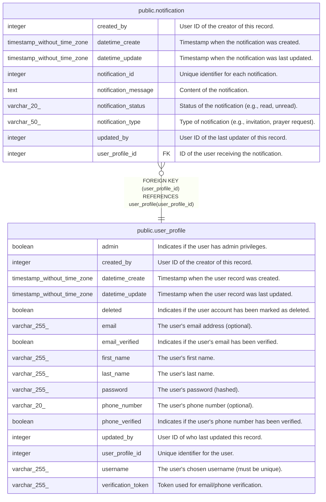

# public.notification

## Description

User notifications

## Columns

| Name                 | Type                        | Default                                               | Nullable | Children | Parents                                       | Comment                                                  |
| -------------------- | --------------------------- | ----------------------------------------------------- | -------- | -------- | --------------------------------------------- | -------------------------------------------------------- |
| created_by           | integer                     |                                                       | false    |          |                                               | User ID of the creator of this record.                   |
| datetime_create      | timestamp without time zone | CURRENT_TIMESTAMP                                     | true     |          |                                               | Timestamp when the notification was created.             |
| datetime_update      | timestamp without time zone | CURRENT_TIMESTAMP                                     | true     |          |                                               | Timestamp when the notification was last updated.        |
| notification_id      | integer                     | nextval('notification_notification_id_seq'::regclass) | false    |          |                                               | Unique identifier for each notification.                 |
| notification_message | text                        |                                                       | true     |          |                                               | Content of the notification.                             |
| notification_status  | varchar(20)                 | 'UNREAD'::character varying                           | true     |          |                                               | Status of the notification (e.g., read, unread).         |
| notification_type    | varchar(50)                 |                                                       | false    |          |                                               | Type of notification (e.g., invitation, prayer request). |
| updated_by           | integer                     |                                                       | false    |          |                                               | User ID of the last updater of this record.              |
| user_profile_id      | integer                     |                                                       | false    |          | [public.user_profile](public.user_profile.md) | ID of the user receiving the notification.               |

## Constraints

| Name                              | Type        | Definition                                                             |
| --------------------------------- | ----------- | ---------------------------------------------------------------------- |
| notification_pkey                 | PRIMARY KEY | PRIMARY KEY (notification_id)                                          |
| notification_user_profile_id_fkey | FOREIGN KEY | FOREIGN KEY (user_profile_id) REFERENCES user_profile(user_profile_id) |

## Indexes

| Name                             | Definition                                                                                                          |
| -------------------------------- | ------------------------------------------------------------------------------------------------------------------- |
| idx_notification_notification_id | CREATE INDEX idx_notification_notification_id ON public.notification USING btree (notification_id)                  |
| idx_notification_user_status     | CREATE INDEX idx_notification_user_status ON public.notification USING btree (user_profile_id, notification_status) |
| idx_notification_user_type       | CREATE INDEX idx_notification_user_type ON public.notification USING btree (user_profile_id, notification_type)     |
| notification_pkey                | CREATE UNIQUE INDEX notification_pkey ON public.notification USING btree (notification_id)                          |

## Triggers

| Name                        | Definition                                                                                                                          |
| --------------------------- | ----------------------------------------------------------------------------------------------------------------------------------- |
| set_datetime_create_trigger | CREATE TRIGGER set_datetime_create_trigger BEFORE INSERT ON public.notification FOR EACH ROW EXECUTE FUNCTION set_datetime_create() |
| set_datetime_update         | CREATE TRIGGER set_datetime_update BEFORE UPDATE ON public.notification FOR EACH ROW EXECUTE FUNCTION update_datetime_update()      |

## Relations

---

> Generated by [tbls](https://github.com/k1LoW/tbls)
