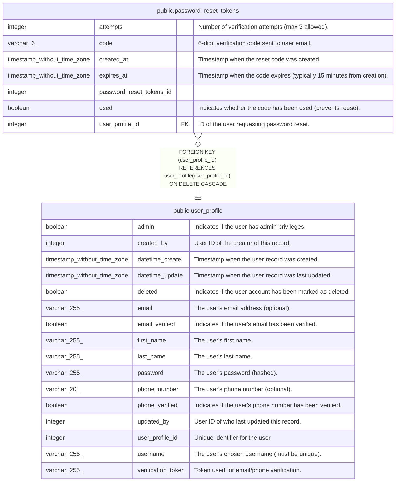

# public.password_reset_tokens

## Description

Password reset verification codes

## Columns

| Name                     | Type                        | Default                                                                 | Nullable | Children | Parents                                       | Comment                                                               |
| ------------------------ | --------------------------- | ----------------------------------------------------------------------- | -------- | -------- | --------------------------------------------- | --------------------------------------------------------------------- |
| attempts                 | integer                     | 0                                                                       | true     |          |                                               | Number of verification attempts (max 3 allowed).                      |
| code                     | varchar(6)                  |                                                                         | false    |          |                                               | 6-digit verification code sent to user email.                         |
| created_at               | timestamp without time zone | CURRENT_TIMESTAMP                                                       | true     |          |                                               | Timestamp when the reset code was created.                            |
| expires_at               | timestamp without time zone |                                                                         | false    |          |                                               | Timestamp when the code expires (typically 15 minutes from creation). |
| password_reset_tokens_id | integer                     | nextval('password_reset_tokens_password_reset_tokens_id_seq'::regclass) | false    |          |                                               |                                                                       |
| used                     | boolean                     | false                                                                   | true     |          |                                               | Indicates whether the code has been used (prevents reuse).            |
| user_profile_id          | integer                     |                                                                         | false    |          | [public.user_profile](public.user_profile.md) | ID of the user requesting password reset.                             |

## Constraints

| Name                                       | Type        | Definition                                                                               |
| ------------------------------------------ | ----------- | ---------------------------------------------------------------------------------------- |
| password_reset_tokens_pkey                 | PRIMARY KEY | PRIMARY KEY (password_reset_tokens_id)                                                   |
| password_reset_tokens_user_profile_id_fkey | FOREIGN KEY | FOREIGN KEY (user_profile_id) REFERENCES user_profile(user_profile_id) ON DELETE CASCADE |

## Indexes

| Name                       | Definition                                                                                                            |
| -------------------------- | --------------------------------------------------------------------------------------------------------------------- |
| idx_password_reset_code    | CREATE INDEX idx_password_reset_code ON public.password_reset_tokens USING btree (code)                               |
| idx_password_reset_expires | CREATE INDEX idx_password_reset_expires ON public.password_reset_tokens USING btree (expires_at)                      |
| idx_password_reset_user    | CREATE INDEX idx_password_reset_user ON public.password_reset_tokens USING btree (user_profile_id)                    |
| password_reset_tokens_pkey | CREATE UNIQUE INDEX password_reset_tokens_pkey ON public.password_reset_tokens USING btree (password_reset_tokens_id) |

## Triggers

| Name                                 | Definition                                                                                                                                                             |
| ------------------------------------ | ---------------------------------------------------------------------------------------------------------------------------------------------------------------------- |
| set_password_reset_tokens_created_at | CREATE TRIGGER set_password_reset_tokens_created_at BEFORE INSERT ON public.password_reset_tokens FOR EACH ROW EXECUTE FUNCTION set_password_reset_tokens_created_at() |

## Relations

---

> Generated by [tbls](https://github.com/k1LoW/tbls)
