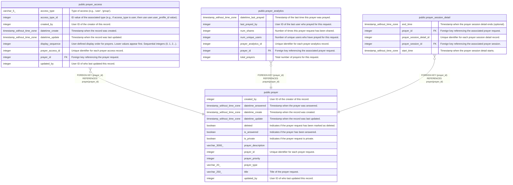

# public.prayer

## Description

Individual prayer requests

## Columns

| Name               | Type                        | Default                                   | Nullable | Children                                                                                                                                                              | Parents | Comment                                                     |
| ------------------ | --------------------------- | ----------------------------------------- | -------- | --------------------------------------------------------------------------------------------------------------------------------------------------------------------- | ------- | ----------------------------------------------------------- |
| created_by         | integer                     |                                           | false    |                                                                                                                                                                       |         | User ID of the creator of this record.                      |
| datetime_answered  | timestamp without time zone |                                           | true     |                                                                                                                                                                       |         | Timestamp when the prayer was answered.                     |
| datetime_create    | timestamp without time zone | CURRENT_TIMESTAMP                         | true     |                                                                                                                                                                       |         | Timestamp when the record was created.                      |
| datetime_update    | timestamp without time zone | CURRENT_TIMESTAMP                         | true     |                                                                                                                                                                       |         | Timestamp when the record was last updated.                 |
| deleted            | boolean                     | false                                     | true     |                                                                                                                                                                       |         | Indicates if the prayer request has been marked as deleted. |
| is_answered        | boolean                     | false                                     | true     |                                                                                                                                                                       |         | Indicates if the prayer has been answered.                  |
| is_private         | boolean                     | false                                     | true     |                                                                                                                                                                       |         | Indicates if the prayer request is private.                 |
| prayer_description | varchar(3000)               |                                           | true     |                                                                                                                                                                       |         |                                                             |
| prayer_id          | integer                     | nextval('prayer_prayer_id_seq'::regclass) | false    | [public.prayer_access](public.prayer_access.md) [public.prayer_analytics](public.prayer_analytics.md) [public.prayer_session_detail](public.prayer_session_detail.md) |         | Unique identifier for each prayer request.                  |
| prayer_priority    | integer                     | 0                                         | true     |                                                                                                                                                                       |         |                                                             |
| prayer_type        | varchar(20)                 |                                           | false    |                                                                                                                                                                       |         |                                                             |
| title              | varchar(250)                |                                           | false    |                                                                                                                                                                       |         | Title of the prayer request.                                |
| updated_by         | integer                     |                                           | false    |                                                                                                                                                                       |         | User ID of who last updated this record.                    |

## Constraints

| Name        | Type        | Definition              |
| ----------- | ----------- | ----------------------- |
| prayer_pkey | PRIMARY KEY | PRIMARY KEY (prayer_id) |

## Indexes

| Name                  | Definition                                                                   |
| --------------------- | ---------------------------------------------------------------------------- |
| idx_prayer_created_by | CREATE INDEX idx_prayer_created_by ON public.prayer USING btree (created_by) |
| prayer_pkey           | CREATE UNIQUE INDEX prayer_pkey ON public.prayer USING btree (prayer_id)     |

## Triggers

| Name                        | Definition                                                                                                                    |
| --------------------------- | ----------------------------------------------------------------------------------------------------------------------------- |
| set_datetime_create_trigger | CREATE TRIGGER set_datetime_create_trigger BEFORE INSERT ON public.prayer FOR EACH ROW EXECUTE FUNCTION set_datetime_create() |
| set_datetime_update         | CREATE TRIGGER set_datetime_update BEFORE UPDATE ON public.prayer FOR EACH ROW EXECUTE FUNCTION update_datetime_update()      |

## Relations

---

> Generated by [tbls](https://github.com/k1LoW/tbls)
