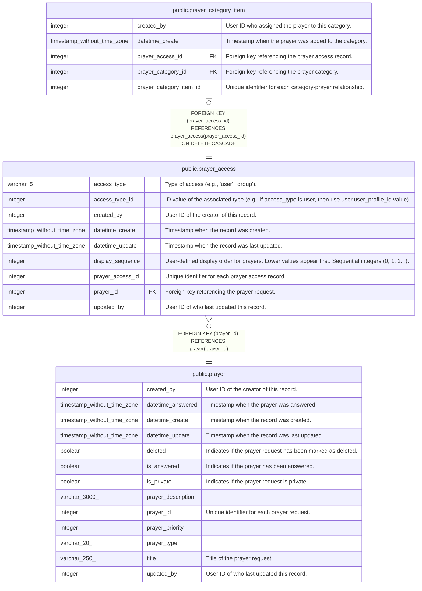

# public.prayer_access

## Description

Controls prayer visibility and sharing

## Columns

| Name             | Type                        | Default                                                 | Nullable | Children                                                      | Parents                           | Comment                                                                                              |
| ---------------- | --------------------------- | ------------------------------------------------------- | -------- | ------------------------------------------------------------- | --------------------------------- | ---------------------------------------------------------------------------------------------------- |
| access_type      | varchar(5)                  |                                                         | false    |                                                               |                                   | Type of access (e.g., 'user', 'group').                                                              |
| access_type_id   | integer                     |                                                         | false    |                                                               |                                   | ID value of the associated type (e.g., if access_type is user, then use user.user_profile_id value). |
| created_by       | integer                     |                                                         | false    |                                                               |                                   | User ID of the creator of this record.                                                               |
| datetime_create  | timestamp without time zone | CURRENT_TIMESTAMP                                       | true     |                                                               |                                   | Timestamp when the record was created.                                                               |
| datetime_update  | timestamp without time zone | CURRENT_TIMESTAMP                                       | true     |                                                               |                                   | Timestamp when the record was last updated.                                                          |
| display_sequence | integer                     | 0                                                       | false    |                                                               |                                   | User-defined display order for prayers. Lower values appear first. Sequential integers (0, 1, 2...). |
| prayer_access_id | integer                     | nextval('prayer_access_prayer_access_id_seq'::regclass) | false    | [public.prayer_category_item](public.prayer_category_item.md) |                                   | Unique identifier for each prayer access record.                                                     |
| prayer_id        | integer                     |                                                         | false    |                                                               | [public.prayer](public.prayer.md) | Foreign key referencing the prayer request.                                                          |
| updated_by       | integer                     |                                                         | false    |                                                               |                                   | User ID of who last updated this record.                                                             |

## Constraints

| Name                         | Type        | Definition                                           |
| ---------------------------- | ----------- | ---------------------------------------------------- |
| prayer_access_pkey           | PRIMARY KEY | PRIMARY KEY (prayer_access_id)                       |
| prayer_access_prayer_id_fkey | FOREIGN KEY | FOREIGN KEY (prayer_id) REFERENCES prayer(prayer_id) |

## Indexes

| Name                               | Definition                                                                                                                          |
| ---------------------------------- | ----------------------------------------------------------------------------------------------------------------------------------- |
| idx_prayer_access_display_sequence | CREATE INDEX idx_prayer_access_display_sequence ON public.prayer_access USING btree (access_type, access_type_id, display_sequence) |
| idx_prayer_access_prayer_id        | CREATE INDEX idx_prayer_access_prayer_id ON public.prayer_access USING btree (prayer_id)                                            |
| idx_prayer_access_type_id          | CREATE UNIQUE INDEX idx_prayer_access_type_id ON public.prayer_access USING btree (prayer_id, access_type, access_type_id)          |
| prayer_access_pkey                 | CREATE UNIQUE INDEX prayer_access_pkey ON public.prayer_access USING btree (prayer_access_id)                                       |

## Triggers

| Name                        | Definition                                                                                                                           |
| --------------------------- | ------------------------------------------------------------------------------------------------------------------------------------ |
| set_datetime_create_trigger | CREATE TRIGGER set_datetime_create_trigger BEFORE INSERT ON public.prayer_access FOR EACH ROW EXECUTE FUNCTION set_datetime_create() |
| set_datetime_update         | CREATE TRIGGER set_datetime_update BEFORE UPDATE ON public.prayer_access FOR EACH ROW EXECUTE FUNCTION update_datetime_update()      |

## Relations

---

> Generated by [tbls](https://github.com/k1LoW/tbls)
