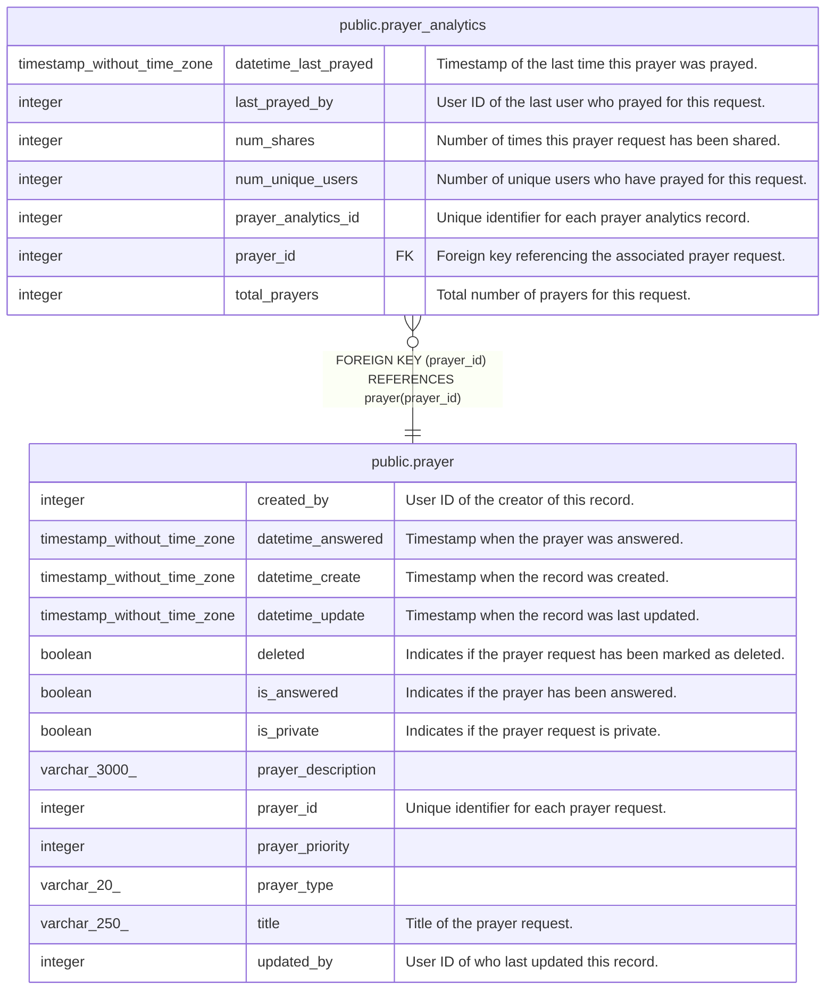

# public.prayer_analytics

## Description

Prayer interaction tracking

## Columns

| Name                 | Type                        | Default                                                       | Nullable | Children | Parents                           | Comment                                                  |
| -------------------- | --------------------------- | ------------------------------------------------------------- | -------- | -------- | --------------------------------- | -------------------------------------------------------- |
| datetime_last_prayed | timestamp without time zone |                                                               | true     |          |                                   | Timestamp of the last time this prayer was prayed.       |
| last_prayed_by       | integer                     |                                                               | true     |          |                                   | User ID of the last user who prayed for this request.    |
| num_shares           | integer                     | 0                                                             | true     |          |                                   | Number of times this prayer request has been shared.     |
| num_unique_users     | integer                     | 0                                                             | true     |          |                                   | Number of unique users who have prayed for this request. |
| prayer_analytics_id  | integer                     | nextval('prayer_analytics_prayer_analytics_id_seq'::regclass) | false    |          |                                   | Unique identifier for each prayer analytics record.      |
| prayer_id            | integer                     |                                                               | false    |          | [public.prayer](public.prayer.md) | Foreign key referencing the associated prayer request.   |
| total_prayers        | integer                     | 0                                                             | true     |          |                                   | Total number of prayers for this request.                |

## Constraints

| Name                            | Type        | Definition                                           |
| ------------------------------- | ----------- | ---------------------------------------------------- |
| prayer_analytics_pkey           | PRIMARY KEY | PRIMARY KEY (prayer_analytics_id)                    |
| prayer_analytics_prayer_id_fkey | FOREIGN KEY | FOREIGN KEY (prayer_id) REFERENCES prayer(prayer_id) |

## Indexes

| Name                           | Definition                                                                                             |
| ------------------------------ | ------------------------------------------------------------------------------------------------------ |
| idx_prayer_analytics_prayer_id | CREATE INDEX idx_prayer_analytics_prayer_id ON public.prayer_analytics USING btree (prayer_id)         |
| prayer_analytics_pkey          | CREATE UNIQUE INDEX prayer_analytics_pkey ON public.prayer_analytics USING btree (prayer_analytics_id) |

## Relations

---

> Generated by [tbls](https://github.com/k1LoW/tbls)
