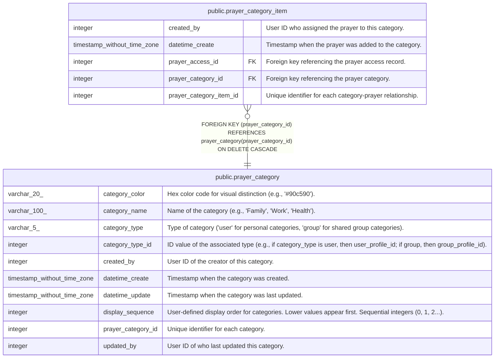

# public.prayer_category

## Description

Prayer category definitions

## Columns

| Name               | Type                        | Default                                                     | Nullable | Children                                                      | Parents | Comment                                                                                                                  |
| ------------------ | --------------------------- | ----------------------------------------------------------- | -------- | ------------------------------------------------------------- | ------- | ------------------------------------------------------------------------------------------------------------------------ |
| category_color     | varchar(20)                 |                                                             | true     |                                                               |         | Hex color code for visual distinction (e.g., '#90c590').                                                                 |
| category_name      | varchar(100)                |                                                             | false    |                                                               |         | Name of the category (e.g., 'Family', 'Work', 'Health').                                                                 |
| category_type      | varchar(5)                  |                                                             | false    |                                                               |         | Type of category ('user' for personal categories, 'group' for shared group categories).                                  |
| category_type_id   | integer                     |                                                             | false    |                                                               |         | ID value of the associated type (e.g., if category_type is user, then user_profile_id; if group, then group_profile_id). |
| created_by         | integer                     |                                                             | false    |                                                               |         | User ID of the creator of this category.                                                                                 |
| datetime_create    | timestamp without time zone | CURRENT_TIMESTAMP                                           | true     |                                                               |         | Timestamp when the category was created.                                                                                 |
| datetime_update    | timestamp without time zone | CURRENT_TIMESTAMP                                           | true     |                                                               |         | Timestamp when the category was last updated.                                                                            |
| display_sequence   | integer                     | 0                                                           | false    |                                                               |         | User-defined display order for categories. Lower values appear first. Sequential integers (0, 1, 2...).                  |
| prayer_category_id | integer                     | nextval('prayer_category_prayer_category_id_seq'::regclass) | false    | [public.prayer_category_item](public.prayer_category_item.md) |         | Unique identifier for each category.                                                                                     |
| updated_by         | integer                     |                                                             | false    |                                                               |         | User ID of who last updated this category.                                                                               |

## Constraints

| Name                 | Type        | Definition                                                                                                     |
| -------------------- | ----------- | -------------------------------------------------------------------------------------------------------------- |
| chk_category_type    | CHECK       | CHECK (((category_type)::text = ANY ((ARRAY['user'::character varying, 'group'::character varying])::text[]))) |
| prayer_category_pkey | PRIMARY KEY | PRIMARY KEY (prayer_category_id)                                                                               |

## Indexes

| Name                                 | Definition                                                                                                                                                |
| ------------------------------------ | --------------------------------------------------------------------------------------------------------------------------------------------------------- |
| idx_prayer_category_display_sequence | CREATE INDEX idx_prayer_category_display_sequence ON public.prayer_category USING btree (category_type, category_type_id, display_sequence)               |
| idx_prayer_category_type_id          | CREATE INDEX idx_prayer_category_type_id ON public.prayer_category USING btree (category_type, category_type_id)                                          |
| idx_unique_prayer_category_name      | CREATE UNIQUE INDEX idx_unique_prayer_category_name ON public.prayer_category USING btree (category_type, category_type_id, lower((category_name)::text)) |
| prayer_category_pkey                 | CREATE UNIQUE INDEX prayer_category_pkey ON public.prayer_category USING btree (prayer_category_id)                                                       |

## Triggers

| Name                        | Definition                                                                                                                             |
| --------------------------- | -------------------------------------------------------------------------------------------------------------------------------------- |
| set_datetime_create_trigger | CREATE TRIGGER set_datetime_create_trigger BEFORE INSERT ON public.prayer_category FOR EACH ROW EXECUTE FUNCTION set_datetime_create() |
| set_datetime_update         | CREATE TRIGGER set_datetime_update BEFORE UPDATE ON public.prayer_category FOR EACH ROW EXECUTE FUNCTION update_datetime_update()      |

## Relations

---

> Generated by [tbls](https://github.com/k1LoW/tbls)
