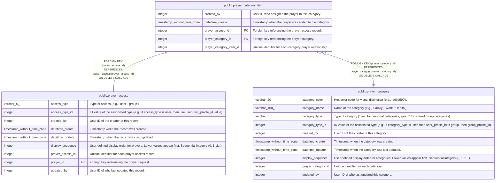

# public.prayer_category_item

## Description

Prayers assigned to categories

## Columns

| Name                    | Type                        | Default                                                               | Nullable | Children | Parents                                             | Comment                                                  |
| ----------------------- | --------------------------- | --------------------------------------------------------------------- | -------- | -------- | --------------------------------------------------- | -------------------------------------------------------- |
| created_by              | integer                     |                                                                       | false    |          |                                                     | User ID who assigned the prayer to this category.        |
| datetime_create         | timestamp without time zone | CURRENT_TIMESTAMP                                                     | true     |          |                                                     | Timestamp when the prayer was added to the category.     |
| prayer_access_id        | integer                     |                                                                       | false    |          | [public.prayer_access](public.prayer_access.md)     | Foreign key referencing the prayer access record.        |
| prayer_category_id      | integer                     |                                                                       | false    |          | [public.prayer_category](public.prayer_category.md) | Foreign key referencing the prayer category.             |
| prayer_category_item_id | integer                     | nextval('prayer_category_item_prayer_category_item_id_seq'::regclass) | false    |          |                                                     | Unique identifier for each category-prayer relationship. |

## Constraints

| Name                                         | Type        | Definition                                                                                        |
| -------------------------------------------- | ----------- | ------------------------------------------------------------------------------------------------- |
| prayer_category_item_pkey                    | PRIMARY KEY | PRIMARY KEY (prayer_category_item_id)                                                             |
| prayer_category_item_prayer_access_id_fkey   | FOREIGN KEY | FOREIGN KEY (prayer_access_id) REFERENCES prayer_access(prayer_access_id) ON DELETE CASCADE       |
| prayer_category_item_prayer_category_id_fkey | FOREIGN KEY | FOREIGN KEY (prayer_category_id) REFERENCES prayer_category(prayer_category_id) ON DELETE CASCADE |
| unique_prayer_category                       | UNIQUE      | UNIQUE (prayer_access_id)                                                                         |

## Indexes

| Name                                 | Definition                                                                                                         |
| ------------------------------------ | ------------------------------------------------------------------------------------------------------------------ |
| idx_prayer_category_item_access_id   | CREATE INDEX idx_prayer_category_item_access_id ON public.prayer_category_item USING btree (prayer_access_id)      |
| idx_prayer_category_item_category_id | CREATE INDEX idx_prayer_category_item_category_id ON public.prayer_category_item USING btree (prayer_category_id)  |
| prayer_category_item_pkey            | CREATE UNIQUE INDEX prayer_category_item_pkey ON public.prayer_category_item USING btree (prayer_category_item_id) |
| unique_prayer_category               | CREATE UNIQUE INDEX unique_prayer_category ON public.prayer_category_item USING btree (prayer_access_id)           |

## Triggers

| Name                        | Definition                                                                                                                                  |
| --------------------------- | ------------------------------------------------------------------------------------------------------------------------------------------- |
| set_datetime_create_trigger | CREATE TRIGGER set_datetime_create_trigger BEFORE INSERT ON public.prayer_category_item FOR EACH ROW EXECUTE FUNCTION set_datetime_create() |

## Relations

---

> Generated by [tbls](https://github.com/k1LoW/tbls)
