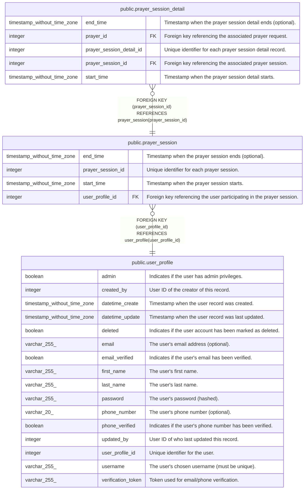

# public.prayer_session

## Description

Prayer session tracking

## Columns

| Name              | Type                        | Default                                                   | Nullable | Children                                                        | Parents                                       | Comment                                                               |
| ----------------- | --------------------------- | --------------------------------------------------------- | -------- | --------------------------------------------------------------- | --------------------------------------------- | --------------------------------------------------------------------- |
| end_time          | timestamp without time zone |                                                           | true     |                                                                 |                                               | Timestamp when the prayer session ends (optional).                    |
| prayer_session_id | integer                     | nextval('prayer_session_prayer_session_id_seq'::regclass) | false    | [public.prayer_session_detail](public.prayer_session_detail.md) |                                               | Unique identifier for each prayer session.                            |
| start_time        | timestamp without time zone |                                                           | false    |                                                                 |                                               | Timestamp when the prayer session starts.                             |
| user_profile_id   | integer                     |                                                           | false    |                                                                 | [public.user_profile](public.user_profile.md) | Foreign key referencing the user participating in the prayer session. |

## Constraints

| Name                                | Type        | Definition                                                             |
| ----------------------------------- | ----------- | ---------------------------------------------------------------------- |
| prayer_session_pkey                 | PRIMARY KEY | PRIMARY KEY (prayer_session_id)                                        |
| prayer_session_user_profile_id_fkey | FOREIGN KEY | FOREIGN KEY (user_profile_id) REFERENCES user_profile(user_profile_id) |

## Indexes

| Name                               | Definition                                                                                             |
| ---------------------------------- | ------------------------------------------------------------------------------------------------------ |
| idx_prayer_session_user_profile_id | CREATE INDEX idx_prayer_session_user_profile_id ON public.prayer_session USING btree (user_profile_id) |
| prayer_session_pkey                | CREATE UNIQUE INDEX prayer_session_pkey ON public.prayer_session USING btree (prayer_session_id)       |

## Relations

---

> Generated by [tbls](https://github.com/k1LoW/tbls)
