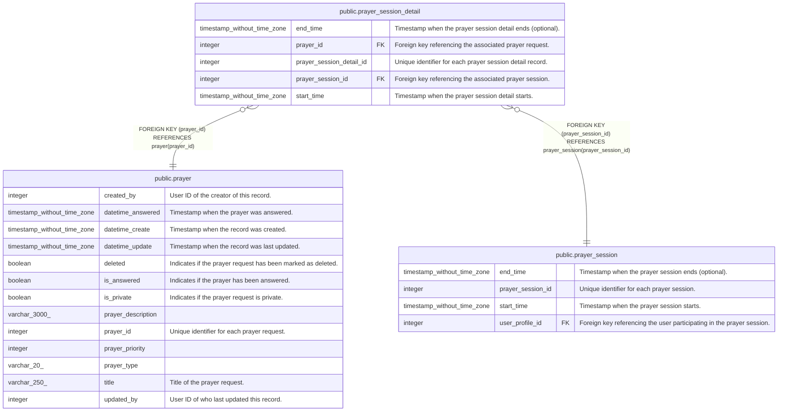

# public.prayer_session_detail

## Description

Individual prayers within a session

## Columns

| Name                     | Type                        | Default                                                                 | Nullable | Children | Parents                                           | Comment                                                   |
| ------------------------ | --------------------------- | ----------------------------------------------------------------------- | -------- | -------- | ------------------------------------------------- | --------------------------------------------------------- |
| end_time                 | timestamp without time zone |                                                                         | true     |          |                                                   | Timestamp when the prayer session detail ends (optional). |
| prayer_id                | integer                     |                                                                         | false    |          | [public.prayer](public.prayer.md)                 | Foreign key referencing the associated prayer request.    |
| prayer_session_detail_id | integer                     | nextval('prayer_session_detail_prayer_session_detail_id_seq'::regclass) | false    |          |                                                   | Unique identifier for each prayer session detail record.  |
| prayer_session_id        | integer                     |                                                                         | false    |          | [public.prayer_session](public.prayer_session.md) | Foreign key referencing the associated prayer session.    |
| start_time               | timestamp without time zone |                                                                         | false    |          |                                                   | Timestamp when the prayer session detail starts.          |

## Constraints

| Name                                         | Type        | Definition                                                                   |
| -------------------------------------------- | ----------- | ---------------------------------------------------------------------------- |
| prayer_session_detail_pkey                   | PRIMARY KEY | PRIMARY KEY (prayer_session_detail_id)                                       |
| prayer_session_detail_prayer_id_fkey         | FOREIGN KEY | FOREIGN KEY (prayer_id) REFERENCES prayer(prayer_id)                         |
| prayer_session_detail_prayer_session_id_fkey | FOREIGN KEY | FOREIGN KEY (prayer_session_id) REFERENCES prayer_session(prayer_session_id) |

## Indexes

| Name                                        | Definition                                                                                                               |
| ------------------------------------------- | ------------------------------------------------------------------------------------------------------------------------ |
| idx_prayer_session_detail_prayer_id         | CREATE INDEX idx_prayer_session_detail_prayer_id ON public.prayer_session_detail USING btree (prayer_id)                 |
| idx_prayer_session_detail_prayer_session_id | CREATE INDEX idx_prayer_session_detail_prayer_session_id ON public.prayer_session_detail USING btree (prayer_session_id) |
| prayer_session_detail_pkey                  | CREATE UNIQUE INDEX prayer_session_detail_pkey ON public.prayer_session_detail USING btree (prayer_session_detail_id)    |

## Relations

---

> Generated by [tbls](https://github.com/k1LoW/tbls)
