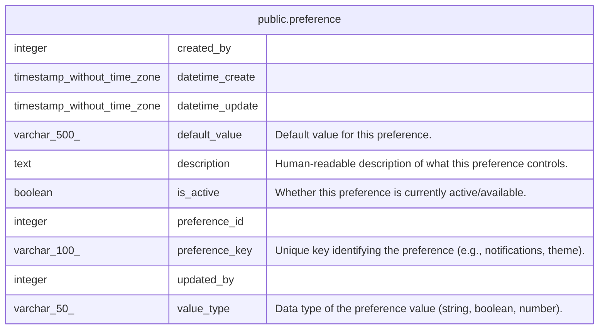

# public.preference

## Description

System preference definitions

## Columns

| Name            | Type                        | Default                                           | Nullable | Children | Parents | Comment                                                             |
| --------------- | --------------------------- | ------------------------------------------------- | -------- | -------- | ------- | ------------------------------------------------------------------- |
| created_by      | integer                     | 1                                                 | false    |          |         |                                                                     |
| datetime_create | timestamp without time zone | CURRENT_TIMESTAMP                                 | true     |          |         |                                                                     |
| datetime_update | timestamp without time zone | CURRENT_TIMESTAMP                                 | true     |          |         |                                                                     |
| default_value   | varchar(500)                |                                                   | false    |          |         | Default value for this preference.                                  |
| description     | text                        |                                                   | true     |          |         | Human-readable description of what this preference controls.        |
| is_active       | boolean                     | true                                              | true     |          |         | Whether this preference is currently active/available.              |
| preference_id   | integer                     | nextval('preference_preference_id_seq'::regclass) | false    |          |         |                                                                     |
| preference_key  | varchar(100)                |                                                   | false    |          |         | Unique key identifying the preference (e.g., notifications, theme). |
| updated_by      | integer                     | 1                                                 | false    |          |         |                                                                     |
| value_type      | varchar(50)                 | 'string'::character varying                       | false    |          |         | Data type of the preference value (string, boolean, number).        |

## Constraints

| Name                          | Type        | Definition                  |
| ----------------------------- | ----------- | --------------------------- |
| preference_pkey               | PRIMARY KEY | PRIMARY KEY (preference_id) |
| preference_preference_key_key | UNIQUE      | UNIQUE (preference_key)     |

## Indexes

| Name                          | Definition                                                                                          |
| ----------------------------- | --------------------------------------------------------------------------------------------------- |
| idx_preference_active         | CREATE INDEX idx_preference_active ON public.preference USING btree (is_active)                     |
| idx_preference_key            | CREATE UNIQUE INDEX idx_preference_key ON public.preference USING btree (preference_key)            |
| preference_pkey               | CREATE UNIQUE INDEX preference_pkey ON public.preference USING btree (preference_id)                |
| preference_preference_key_key | CREATE UNIQUE INDEX preference_preference_key_key ON public.preference USING btree (preference_key) |

## Triggers

| Name                                   | Definition                                                                                                                                      |
| -------------------------------------- | ----------------------------------------------------------------------------------------------------------------------------------------------- |
| set_datetime_create_preference_trigger | CREATE TRIGGER set_datetime_create_preference_trigger BEFORE INSERT ON public.preference FOR EACH ROW EXECUTE FUNCTION set_datetime_create()    |
| set_datetime_update_preference_trigger | CREATE TRIGGER set_datetime_update_preference_trigger BEFORE UPDATE ON public.preference FOR EACH ROW EXECUTE FUNCTION update_datetime_update() |

## Relations

---

> Generated by [tbls](https://github.com/k1LoW/tbls)
