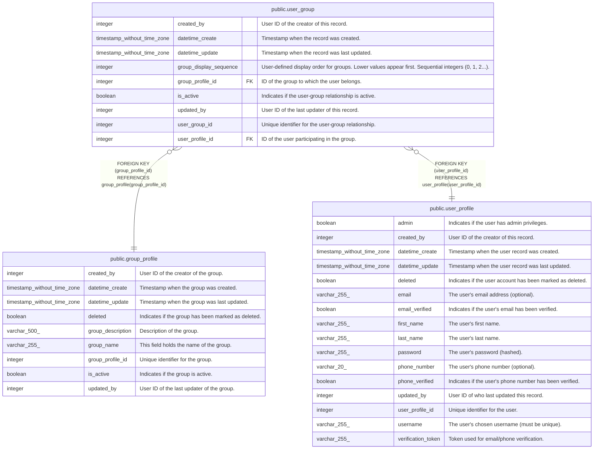

# public.user_group

## Description

User-to-group membership

## Columns

| Name                   | Type                        | Default                                           | Nullable | Children | Parents                                         | Comment                                                                                             |
| ---------------------- | --------------------------- | ------------------------------------------------- | -------- | -------- | ----------------------------------------------- | --------------------------------------------------------------------------------------------------- |
| created_by             | integer                     |                                                   | false    |          |                                                 | User ID of the creator of this record.                                                              |
| datetime_create        | timestamp without time zone | CURRENT_TIMESTAMP                                 | true     |          |                                                 | Timestamp when the record was created.                                                              |
| datetime_update        | timestamp without time zone | CURRENT_TIMESTAMP                                 | true     |          |                                                 | Timestamp when the record was last updated.                                                         |
| group_display_sequence | integer                     | 0                                                 | false    |          |                                                 | User-defined display order for groups. Lower values appear first. Sequential integers (0, 1, 2...). |
| group_profile_id       | integer                     |                                                   | false    |          | [public.group_profile](public.group_profile.md) | ID of the group to which the user belongs.                                                          |
| is_active              | boolean                     | true                                              | true     |          |                                                 | Indicates if the user-group relationship is active.                                                 |
| updated_by             | integer                     |                                                   | false    |          |                                                 | User ID of the last updater of this record.                                                         |
| user_group_id          | integer                     | nextval('user_group_user_group_id_seq'::regclass) | false    |          |                                                 | Unique identifier for the user-group relationship.                                                  |
| user_profile_id        | integer                     |                                                   | false    |          | [public.user_profile](public.user_profile.md)   | ID of the user participating in the group.                                                          |

## Constraints

| Name                             | Type        | Definition                                                                |
| -------------------------------- | ----------- | ------------------------------------------------------------------------- |
| user_group_group_profile_id_fkey | FOREIGN KEY | FOREIGN KEY (group_profile_id) REFERENCES group_profile(group_profile_id) |
| user_group_pkey                  | PRIMARY KEY | PRIMARY KEY (user_group_id)                                               |
| user_group_user_profile_id_fkey  | FOREIGN KEY | FOREIGN KEY (user_profile_id) REFERENCES user_profile(user_profile_id)    |

## Indexes

| Name                            | Definition                                                                                                              |
| ------------------------------- | ----------------------------------------------------------------------------------------------------------------------- |
| idx_user_group_display_sequence | CREATE INDEX idx_user_group_display_sequence ON public.user_group USING btree (user_profile_id, group_display_sequence) |
| idx_user_group_userid_groupid   | CREATE UNIQUE INDEX idx_user_group_userid_groupid ON public.user_group USING btree (user_profile_id, group_profile_id)  |
| user_group_pkey                 | CREATE UNIQUE INDEX user_group_pkey ON public.user_group USING btree (user_group_id)                                    |

## Triggers

| Name                        | Definition                                                                                                                        |
| --------------------------- | --------------------------------------------------------------------------------------------------------------------------------- |
| set_datetime_create_trigger | CREATE TRIGGER set_datetime_create_trigger BEFORE INSERT ON public.user_group FOR EACH ROW EXECUTE FUNCTION set_datetime_create() |
| set_datetime_update         | CREATE TRIGGER set_datetime_update BEFORE UPDATE ON public.user_group FOR EACH ROW EXECUTE FUNCTION update_datetime_update()      |

## Relations

---

> Generated by [tbls](https://github.com/k1LoW/tbls)
