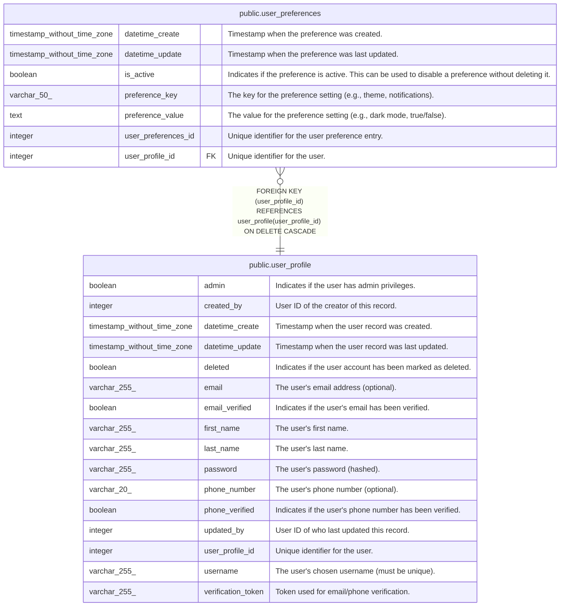

# public.user_preferences

## Description

User-specific preference values

## Columns

| Name                | Type                        | Default                                                       | Nullable | Children | Parents                                       | Comment                                                                                              |
| ------------------- | --------------------------- | ------------------------------------------------------------- | -------- | -------- | --------------------------------------------- | ---------------------------------------------------------------------------------------------------- |
| datetime_create     | timestamp without time zone | CURRENT_TIMESTAMP                                             | true     |          |                                               | Timestamp when the preference was created.                                                           |
| datetime_update     | timestamp without time zone | CURRENT_TIMESTAMP                                             | true     |          |                                               | Timestamp when the preference was last updated.                                                      |
| is_active           | boolean                     | true                                                          | true     |          |                                               | Indicates if the preference is active. This can be used to disable a preference without deleting it. |
| preference_key      | varchar(50)                 |                                                               | false    |          |                                               | The key for the preference setting (e.g., theme, notifications).                                     |
| preference_value    | text                        |                                                               | true     |          |                                               | The value for the preference setting (e.g., dark mode, true/false).                                  |
| user_preferences_id | integer                     | nextval('user_preferences_user_preferences_id_seq'::regclass) | false    |          |                                               | Unique identifier for the user preference entry.                                                     |
| user_profile_id     | integer                     |                                                               | false    |          | [public.user_profile](public.user_profile.md) | Unique identifier for the user.                                                                      |

## Constraints

| Name                                  | Type        | Definition                                                                               |
| ------------------------------------- | ----------- | ---------------------------------------------------------------------------------------- |
| user_preferences_pkey                 | PRIMARY KEY | PRIMARY KEY (user_preferences_id)                                                        |
| user_preferences_user_profile_id_fkey | FOREIGN KEY | FOREIGN KEY (user_profile_id) REFERENCES user_profile(user_profile_id) ON DELETE CASCADE |

## Indexes

| Name                                     | Definition                                                                                                                     |
| ---------------------------------------- | ------------------------------------------------------------------------------------------------------------------------------ |
| idx_user_preferences_preference_key      | CREATE INDEX idx_user_preferences_preference_key ON public.user_preferences USING btree (preference_key)                       |
| idx_user_preferences_user_preference_key | CREATE INDEX idx_user_preferences_user_preference_key ON public.user_preferences USING btree (user_profile_id, preference_key) |
| idx_user_preferences_user_profile_id     | CREATE INDEX idx_user_preferences_user_profile_id ON public.user_preferences USING btree (user_profile_id)                     |
| user_preferences_pkey                    | CREATE UNIQUE INDEX user_preferences_pkey ON public.user_preferences USING btree (user_preferences_id)                         |

## Triggers

| Name                        | Definition                                                                                                                                 |
| --------------------------- | ------------------------------------------------------------------------------------------------------------------------------------------ |
| set_datetime_create_trigger | CREATE TRIGGER set_datetime_create_trigger BEFORE INSERT ON public.user_preferences FOR EACH ROW EXECUTE FUNCTION set_datetime_create()    |
| set_datetime_update_trigger | CREATE TRIGGER set_datetime_update_trigger BEFORE UPDATE ON public.user_preferences FOR EACH ROW EXECUTE FUNCTION update_datetime_update() |

## Relations

---

> Generated by [tbls](https://github.com/k1LoW/tbls)
