# public.user_profile

## Description

Core user account information

## Columns

| Name               | Type                        | Default                                               | Nullable | Children                                                                                                                                                                                                                                                                                                                                                        | Parents | Comment                                                   |
| ------------------ | --------------------------- | ----------------------------------------------------- | -------- | --------------------------------------------------------------------------------------------------------------------------------------------------------------------------------------------------------------------------------------------------------------------------------------------------------------------------------------------------------------- | ------- | --------------------------------------------------------- |
| admin              | boolean                     | false                                                 | true     |                                                                                                                                                                                                                                                                                                                                                                 |         | Indicates if the user has admin privileges.               |
| created_by         | integer                     |                                                       | false    |                                                                                                                                                                                                                                                                                                                                                                 |         | User ID of the creator of this record.                    |
| datetime_create    | timestamp without time zone | CURRENT_TIMESTAMP                                     | true     |                                                                                                                                                                                                                                                                                                                                                                 |         | Timestamp when the user record was created.               |
| datetime_update    | timestamp without time zone | CURRENT_TIMESTAMP                                     | true     |                                                                                                                                                                                                                                                                                                                                                                 |         | Timestamp when the user record was last updated.          |
| deleted            | boolean                     | false                                                 | true     |                                                                                                                                                                                                                                                                                                                                                                 |         | Indicates if the user account has been marked as deleted. |
| email              | varchar(255)                |                                                       | true     |                                                                                                                                                                                                                                                                                                                                                                 |         | The user's email address (optional).                      |
| email_verified     | boolean                     | false                                                 | true     |                                                                                                                                                                                                                                                                                                                                                                 |         | Indicates if the user's email has been verified.          |
| first_name         | varchar(255)                |                                                       | false    |                                                                                                                                                                                                                                                                                                                                                                 |         | The user's first name.                                    |
| last_name          | varchar(255)                |                                                       | false    |                                                                                                                                                                                                                                                                                                                                                                 |         | The user's last name.                                     |
| password           | varchar(255)                |                                                       | false    |                                                                                                                                                                                                                                                                                                                                                                 |         | The user's password (hashed).                             |
| phone_number       | varchar(20)                 |                                                       | true     |                                                                                                                                                                                                                                                                                                                                                                 |         | The user's phone number (optional).                       |
| phone_verified     | boolean                     | false                                                 | true     |                                                                                                                                                                                                                                                                                                                                                                 |         | Indicates if the user's phone number has been verified.   |
| updated_by         | integer                     |                                                       | false    |                                                                                                                                                                                                                                                                                                                                                                 |         | User ID of who last updated this record.                  |
| user_profile_id    | integer                     | nextval('user_profile_user_profile_id_seq'::regclass) | false    | [public.notification](public.notification.md) [public.password_reset_tokens](public.password_reset_tokens.md) [public.prayer_session](public.prayer_session.md) [public.user_group](public.user_group.md) [public.user_preferences](public.user_preferences.md) [public.user_push_tokens](public.user_push_tokens.md) [public.user_stats](public.user_stats.md) |         | Unique identifier for the user.                           |
| username           | varchar(255)                |                                                       | false    |                                                                                                                                                                                                                                                                                                                                                                 |         | The user's chosen username (must be unique).              |
| verification_token | varchar(255)                |                                                       | true     |                                                                                                                                                                                                                                                                                                                                                                 |         | Token used for email/phone verification.                  |

## Constraints

| Name                      | Type        | Definition                    |
| ------------------------- | ----------- | ----------------------------- |
| user_profile_email_key    | UNIQUE      | UNIQUE (email)                |
| user_profile_pkey         | PRIMARY KEY | PRIMARY KEY (user_profile_id) |
| user_profile_username_key | UNIQUE      | UNIQUE (username)             |

## Indexes

| Name                                | Definition                                                                                               |
| ----------------------------------- | -------------------------------------------------------------------------------------------------------- |
| idx_user_profile_admin              | CREATE INDEX idx_user_profile_admin ON public.user_profile USING btree (admin)                           |
| idx_user_profile_email              | CREATE UNIQUE INDEX idx_user_profile_email ON public.user_profile USING btree (email)                    |
| idx_user_profile_phone_number       | CREATE INDEX idx_user_profile_phone_number ON public.user_profile USING btree (phone_number)             |
| idx_user_profile_username           | CREATE UNIQUE INDEX idx_user_profile_username ON public.user_profile USING btree (username)              |
| idx_user_profile_verification_token | CREATE INDEX idx_user_profile_verification_token ON public.user_profile USING btree (verification_token) |
| user_profile_email_key              | CREATE UNIQUE INDEX user_profile_email_key ON public.user_profile USING btree (email)                    |
| user_profile_pkey                   | CREATE UNIQUE INDEX user_profile_pkey ON public.user_profile USING btree (user_profile_id)               |
| user_profile_username_key           | CREATE UNIQUE INDEX user_profile_username_key ON public.user_profile USING btree (username)              |

## Triggers

| Name                        | Definition                                                                                                                          |
| --------------------------- | ----------------------------------------------------------------------------------------------------------------------------------- |
| set_datetime_create_trigger | CREATE TRIGGER set_datetime_create_trigger BEFORE INSERT ON public.user_profile FOR EACH ROW EXECUTE FUNCTION set_datetime_create() |
| set_datetime_update         | CREATE TRIGGER set_datetime_update BEFORE UPDATE ON public.user_profile FOR EACH ROW EXECUTE FUNCTION update_datetime_update()      |

## Relations

```mermaid
erDiagram

"public.notification" }o--|| "public.user_profile" : "FOREIGN KEY (user_profile_id) REFERENCES user_profile(user_profile_id)"
"public.password_reset_tokens" }o--|| "public.user_profile" : "FOREIGN KEY (user_profile_id) REFERENCES user_profile(user_profile_id) ON DELETE CASCADE"
"public.prayer_session" }o--|| "public.user_profile" : "FOREIGN KEY (user_profile_id) REFERENCES user_profile(user_profile_id)"
"public.user_group" }o--|| "public.user_profile" : "FOREIGN KEY (user_profile_id) REFERENCES user_profile(user_profile_id)"
"public.user_preferences" }o--|| "public.user_profile" : "FOREIGN KEY (user_profile_id) REFERENCES user_profile(user_profile_id) ON DELETE CASCADE"
"public.user_push_tokens" }o--|| "public.user_profile" : "FOREIGN KEY (user_profile_id) REFERENCES user_profile(user_profile_id) ON DELETE CASCADE"
"public.user_stats" }o--|| "public.user_profile" : "FOREIGN KEY (user_profile_id) REFERENCES user_profile(user_profile_id)"

"public.user_profile" {
  boolean admin "Indicates if the user has admin privileges."
  integer created_by "User ID of the creator of this record."
  timestamp_without_time_zone datetime_create "Timestamp when the user record was created."
  timestamp_without_time_zone datetime_update "Timestamp when the user record was last updated."
  boolean deleted "Indicates if the user account has been marked as deleted."
  varchar_255_ email "The user's email address (optional)."
  boolean email_verified "Indicates if the user's email has been verified."
  varchar_255_ first_name "The user's first name."
  varchar_255_ last_name "The user's last name."
  varchar_255_ password "The user's password (hashed)."
  varchar_20_ phone_number "The user's phone number (optional)."
  boolean phone_verified "Indicates if the user's phone number has been verified."
  integer updated_by "User ID of who last updated this record."
  integer user_profile_id "Unique identifier for the user."
  varchar_255_ username "The user's chosen username (must be unique)."
  varchar_255_ verification_token "Token used for email/phone verification."
}
"public.notification" {
  integer created_by "User ID of the creator of this record."
  timestamp_without_time_zone datetime_create "Timestamp when the notification was created."
  timestamp_without_time_zone datetime_update "Timestamp when the notification was last updated."
  integer notification_id "Unique identifier for each notification."
  text notification_message "Content of the notification."
  varchar_20_ notification_status "Status of the notification (e.g., read, unread)."
  varchar_50_ notification_type "Type of notification (e.g., invitation, prayer request)."
  integer updated_by "User ID of the last updater of this record."
  integer user_profile_id FK "ID of the user receiving the notification."
}
"public.password_reset_tokens" {
  integer attempts "Number of verification attempts (max 3 allowed)."
  varchar_6_ code "6-digit verification code sent to user email."
  timestamp_without_time_zone created_at "Timestamp when the reset code was created."
  timestamp_without_time_zone expires_at "Timestamp when the code expires (typically 15 minutes from creation)."
  integer password_reset_tokens_id ""
  boolean used "Indicates whether the code has been used (prevents reuse)."
  integer user_profile_id FK "ID of the user requesting password reset."
}
"public.prayer_session" {
  timestamp_without_time_zone end_time "Timestamp when the prayer session ends (optional)."
  integer prayer_session_id "Unique identifier for each prayer session."
  timestamp_without_time_zone start_time "Timestamp when the prayer session starts."
  integer user_profile_id FK "Foreign key referencing the user participating in the prayer session."
}
"public.user_group" {
  integer created_by "User ID of the creator of this record."
  timestamp_without_time_zone datetime_create "Timestamp when the record was created."
  timestamp_without_time_zone datetime_update "Timestamp when the record was last updated."
  integer group_display_sequence "User-defined display order for groups. Lower values appear first. Sequential integers (0, 1, 2...)."
  integer group_profile_id FK "ID of the group to which the user belongs."
  boolean is_active "Indicates if the user-group relationship is active."
  integer updated_by "User ID of the last updater of this record."
  integer user_group_id "Unique identifier for the user-group relationship."
  integer user_profile_id FK "ID of the user participating in the group."
}
"public.user_preferences" {
  timestamp_without_time_zone datetime_create "Timestamp when the preference was created."
  timestamp_without_time_zone datetime_update "Timestamp when the preference was last updated."
  boolean is_active "Indicates if the preference is active. This can be used to disable a preference without deleting it."
  varchar_50_ preference_key "The key for the preference setting (e.g., theme, notifications)."
  text preference_value "The value for the preference setting (e.g., dark mode, true/false)."
  integer user_preferences_id "Unique identifier for the user preference entry."
  integer user_profile_id FK "Unique identifier for the user."
}
"public.user_push_tokens" {
  timestamp_without_time_zone created_at "Timestamp when the record was created."
  varchar_10_ platform "The platform for which the push token is valid (ios or android)."
  varchar_500_ push_token "The push notification token for the user."
  timestamp_without_time_zone updated_at "Timestamp when the record was last updated."
  integer user_profile_id FK "ID of the user associated with the push token."
  integer user_push_tokens_id "Unique identifier for the push token record."
}
"public.user_stats" {
  integer active_streak "Current streak of consecutive active days."
  integer days_active "Total number of days the user has been active."
  integer prayers_prayed "Total number of prayers prayed by the user."
  interval time_prayed "Total time spent praying by the user."
  integer user_profile_id FK "Foreign key referencing the associated user."
  integer user_stats_id "Unique identifier for each user stats record."
}
```

---

> Generated by [tbls](https://github.com/k1LoW/tbls)
