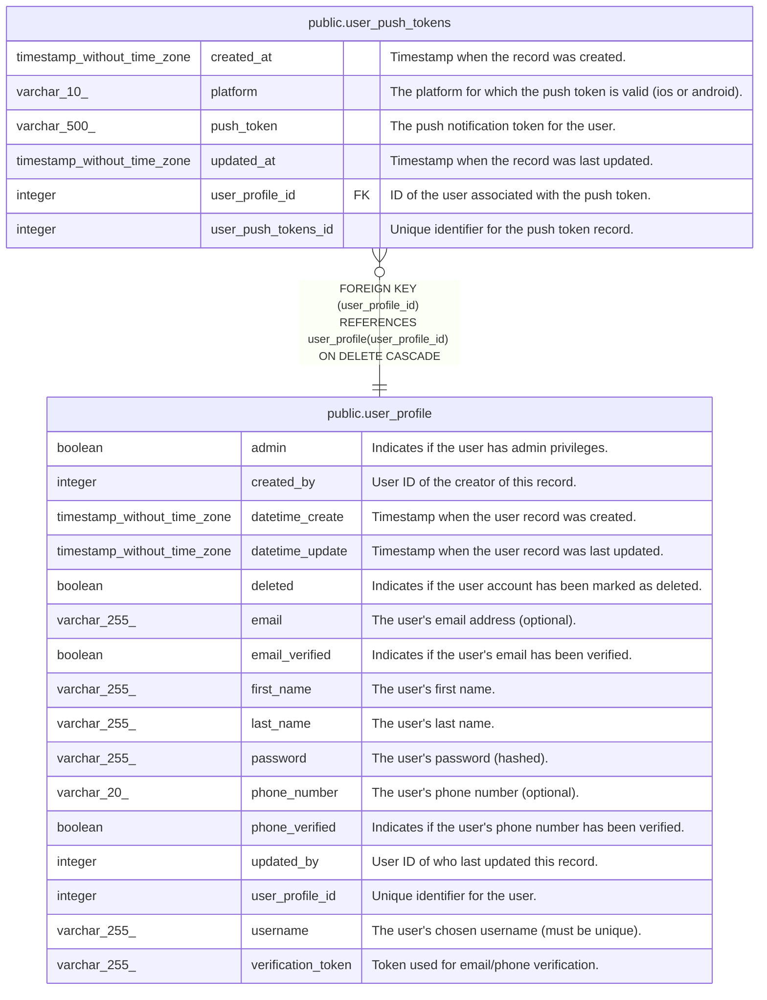

# public.user_push_tokens

## Description

FCM push notification tokens

## Columns

| Name                | Type                        | Default                                                       | Nullable | Children | Parents                                       | Comment                                                          |
| ------------------- | --------------------------- | ------------------------------------------------------------- | -------- | -------- | --------------------------------------------- | ---------------------------------------------------------------- |
| created_at          | timestamp without time zone | CURRENT_TIMESTAMP                                             | true     |          |                                               | Timestamp when the record was created.                           |
| platform            | varchar(10)                 |                                                               | false    |          |                                               | The platform for which the push token is valid (ios or android). |
| push_token          | varchar(500)                |                                                               | false    |          |                                               | The push notification token for the user.                        |
| updated_at          | timestamp without time zone | CURRENT_TIMESTAMP                                             | true     |          |                                               | Timestamp when the record was last updated.                      |
| user_profile_id     | integer                     |                                                               | false    |          | [public.user_profile](public.user_profile.md) | ID of the user associated with the push token.                   |
| user_push_tokens_id | integer                     | nextval('user_push_tokens_user_push_tokens_id_seq'::regclass) | false    |          |                                               | Unique identifier for the push token record.                     |

## Constraints

| Name                                  | Type        | Definition                                                                                                 |
| ------------------------------------- | ----------- | ---------------------------------------------------------------------------------------------------------- |
| user_push_tokens_pkey                 | PRIMARY KEY | PRIMARY KEY (user_push_tokens_id)                                                                          |
| user_push_tokens_platform_check       | CHECK       | CHECK (((platform)::text = ANY ((ARRAY['ios'::character varying, 'android'::character varying])::text[]))) |
| user_push_tokens_user_profile_id_fkey | FOREIGN KEY | FOREIGN KEY (user_profile_id) REFERENCES user_profile(user_profile_id) ON DELETE CASCADE                   |

## Indexes

| Name                              | Definition                                                                                                                 |
| --------------------------------- | -------------------------------------------------------------------------------------------------------------------------- |
| idx_user_push_tokens_platform     | CREATE INDEX idx_user_push_tokens_platform ON public.user_push_tokens USING btree (platform)                               |
| idx_user_push_tokens_user_id      | CREATE INDEX idx_user_push_tokens_user_id ON public.user_push_tokens USING btree (user_profile_id)                         |
| idx_user_push_tokens_userid_token | CREATE UNIQUE INDEX idx_user_push_tokens_userid_token ON public.user_push_tokens USING btree (user_profile_id, push_token) |
| user_push_tokens_pkey             | CREATE UNIQUE INDEX user_push_tokens_pkey ON public.user_push_tokens USING btree (user_push_tokens_id)                     |

## Triggers

| Name                            | Definition                                                                                                                                                 |
| ------------------------------- | ---------------------------------------------------------------------------------------------------------------------------------------------------------- |
| set_user_push_tokens_created_at | CREATE TRIGGER set_user_push_tokens_created_at BEFORE INSERT ON public.user_push_tokens FOR EACH ROW EXECUTE FUNCTION set_user_push_tokens_created_at()    |
| set_user_push_tokens_updated_at | CREATE TRIGGER set_user_push_tokens_updated_at BEFORE UPDATE ON public.user_push_tokens FOR EACH ROW EXECUTE FUNCTION update_user_push_tokens_updated_at() |

## Relations

---

> Generated by [tbls](https://github.com/k1LoW/tbls)
