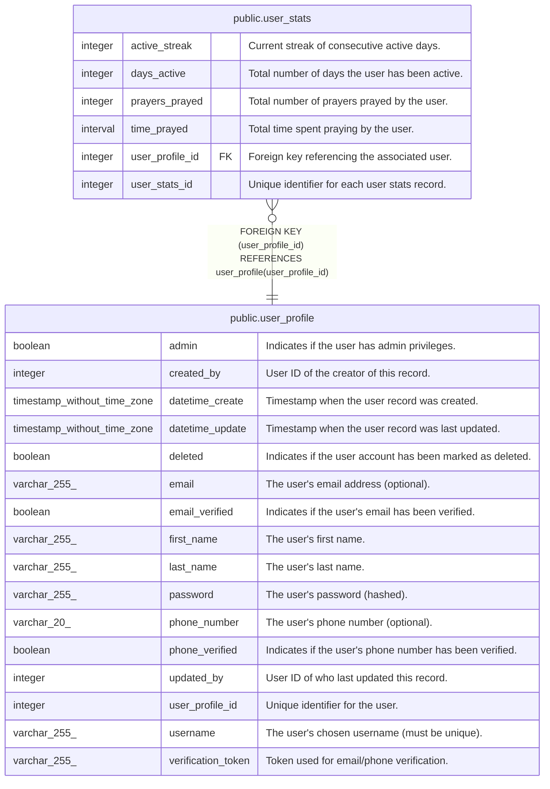

# public.user_stats

## Description

Aggregated user statistics

## Columns

| Name            | Type     | Default                                           | Nullable | Children | Parents                                       | Comment                                        |
| --------------- | -------- | ------------------------------------------------- | -------- | -------- | --------------------------------------------- | ---------------------------------------------- |
| active_streak   | integer  | 0                                                 | true     |          |                                               | Current streak of consecutive active days.     |
| days_active     | integer  | 0                                                 | true     |          |                                               | Total number of days the user has been active. |
| prayers_prayed  | integer  | 0                                                 | true     |          |                                               | Total number of prayers prayed by the user.    |
| time_prayed     | interval | '00:00:00'::interval                              | true     |          |                                               | Total time spent praying by the user.          |
| user_profile_id | integer  |                                                   | false    |          | [public.user_profile](public.user_profile.md) | Foreign key referencing the associated user.   |
| user_stats_id   | integer  | nextval('user_stats_user_stats_id_seq'::regclass) | false    |          |                                               | Unique identifier for each user stats record.  |

## Constraints

| Name                            | Type        | Definition                                                             |
| ------------------------------- | ----------- | ---------------------------------------------------------------------- |
| user_stats_pkey                 | PRIMARY KEY | PRIMARY KEY (user_stats_id)                                            |
| user_stats_user_profile_id_fkey | FOREIGN KEY | FOREIGN KEY (user_profile_id) REFERENCES user_profile(user_profile_id) |

## Indexes

| Name                   | Definition                                                                                    |
| ---------------------- | --------------------------------------------------------------------------------------------- |
| idx_user_stats_user_id | CREATE UNIQUE INDEX idx_user_stats_user_id ON public.user_stats USING btree (user_profile_id) |
| user_stats_pkey        | CREATE UNIQUE INDEX user_stats_pkey ON public.user_stats USING btree (user_stats_id)          |

## Relations

---

> Generated by [tbls](https://github.com/k1LoW/tbls)
